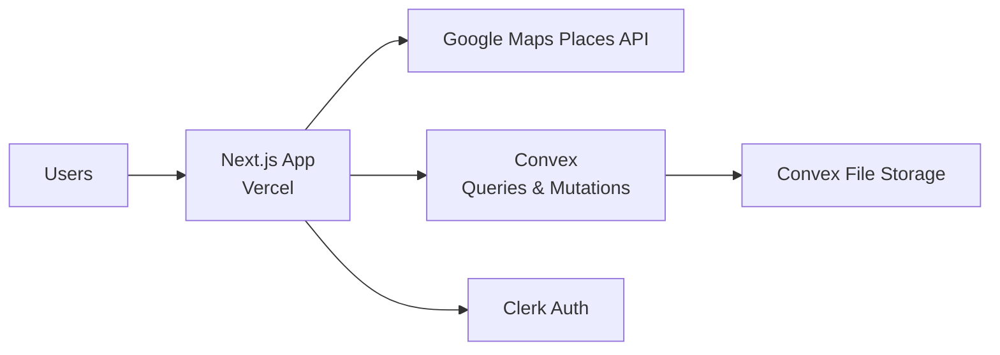
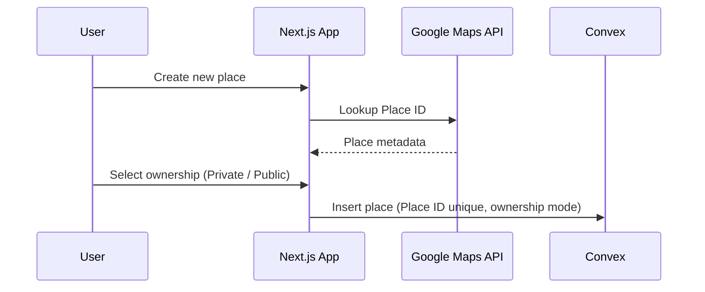
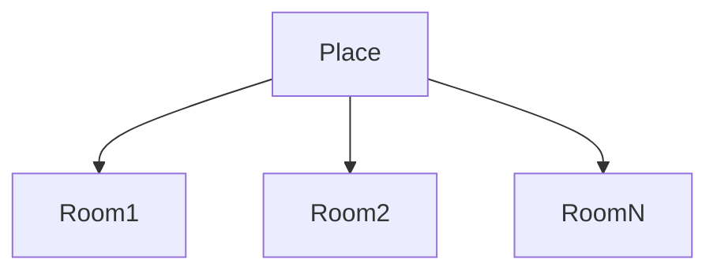
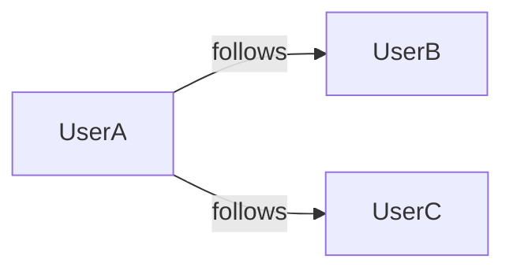

# Escape Rooms Ranked
Online escape room ranking and rating service.

## System Roadmap & High-Level Design

This document describes the architecture, core components, and data flows of the Escape Room Platform. It enables users to discover, register, and review real-world escape rooms and track shared experiences with other users.

---

## 1. Goals and Principles

* Centralized, non-duplicated registry of real escape room locations
* Strong data integrity using Google Maps Place IDs
* Community-driven reviews and experience tracking
* Simple, scalable architecture
* Clear separation of frontend, backend, and infrastructure concerns

---

## 2. Technology Stack Overview

### Frontend

* Google Maps Places API (Place ID lookup)
* Next.js 16+ (App Router)
* Tailwind CSS v4+
* shadcn/ui (neobrutalism fork)
* lucide-react for icons

### Backend / Platform Services

* Convex (queries, mutations, auth integration)
* Convex File Storage (images)

### Authentication

* Clerk (Next.js integration, Google social login)


### Infrastructure

* Hosted at Vercel and Convex

---

## 3. High-Level System Architecture




---

## 4. Project Structure

The repository is organized as a monorepo with the frontend app in a dedicated folder.

```
.
├── README.md
└── escrr-frontend/
  ├── app/
  ├── components/
  │   └── ui/
  ├── public/
  │   └── icons/
  ├── components.json
  ├── eslint.config.mjs
  ├── next-env.d.ts
  ├── next.config.ts
  ├── package.json
  ├── postcss.config.mjs
  ├── proxy.ts
  └── tsconfig.json
```

## 5. Local Development

* From `escrr-frontend/`, install dependencies with `bun install`.
* Start the Next.js dev server with `bun dev`.
* Set required environment variables in Vercel and mirror them locally.

## 6. Core Domain Model

### Main Entities

* **User**
* **Place** (Escape room location)
* **Room** (Specific escape room experience)
* **Rating** (User evaluation of a room)
* **Visit / Run / review** (A single completed attempt of a room)
* **Tag** (Room attributes)

---

## 7. Authentication & User Management

### Supported Authentication Methods

* Clerk email/password
* Clerk Google social login


---

## 8. Place Creation & Verification

### Place Creation Flow

* Users can create a **Place** only by providing a valid Google Maps Place ID
* Place ID ensures:

  * No duplicates
  * Real-world verification
  * Anti-spam protection
* During creation, the user must choose a **Place ownership mode**:

  * **Private (Owned)** – the creating user is the owner

    * Only the owner can edit Place details
    * Only the owner can create, edit, or delete Rooms under the Place
  * **Public (Community-managed)**

    * Any authenticated user may edit Place details
    * Any authenticated user may create, edit, or delete Rooms under the Place



Each place may have:

* Name
* Address
* Google Place ID (unique)
* Ownership mode (Private / Public)
* Owner user ID (if Private)
* One image (vibe/branding)

---

## 9. Room Management

Rooms belong to a Place.

Room creation and editing permissions depend on the Place ownership mode:

* **Private Place**

  * Only the Place owner may create, edit, or delete Rooms
* **Public Place**

  * Any authenticated user may create, edit, or delete Rooms

Room attributes include:

* Name
* Duration
* Description (typically official description)
* Tags (e.g. "live actors", "not plus size friendly")
* Images

> **Verification note:** Ownership-based permissions are enforced in Convex mutation logic and server-side validation. Additional verification (e.g. official place claims) is considered a future enhancement.



---

## 10. Rating & Review System

Users can rate rooms on multiple scales:

* Scary
* Difficulty
* Immersion
* Decoration
* Overall

Each rating is tied to a **Visit / Run**, not just the room.

### Visit / Run

A user may register multiple visits per room.

Visit data includes:

* Completion time
* Linked users (who participated together)
* Short experience description

---

## 11. Social Features

### User Relationships

* Users can mark other users as **Favorites**
* Favorites appear first in search results
* Users can see:

  * Friends' completed rooms
  * Friends' visited places



No profile pictures are supported at this stage.

---

## 12. Media Handling

* Images stored in Convex File Storage

* Many images per Place
* Many images per Room

---

## 13. Deployment Overview

* Frontend is deployed to Vercel.
* Every dev branch deploys a Vercel Preview.
* Pull requests to main deploy to Production on merge.
* Backend runs on Convex (queries, mutations, and file storage).
* Authentication is handled by Clerk.
* Environment variables are configured in Vercel for API keys and service URLs.

---

## 14. Future Roadmap (Non-Exhaustive)

* Room ownership verification
* Moderation tools for places and rooms
* Aggregated statistics and leaderboards
* Advanced tagging and filtering
* Profile customization

---

## 15. Summary

The platform is designed as a clean, modular system where Google Maps Place IDs serve as the backbone for real-world verification, enabling a trustworthy, community-driven escape room discovery and tracking platform.
