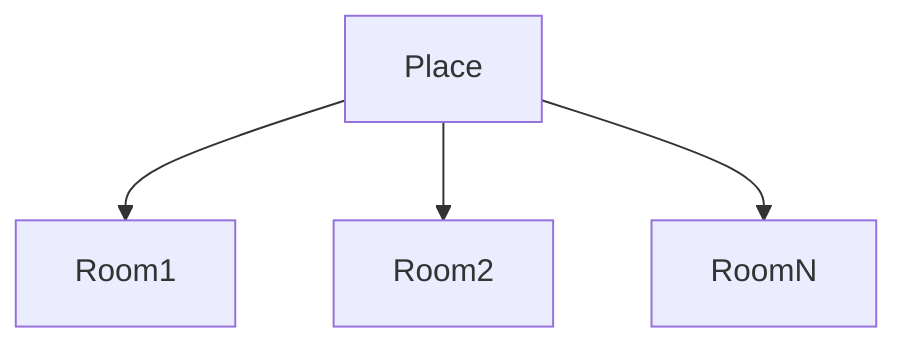
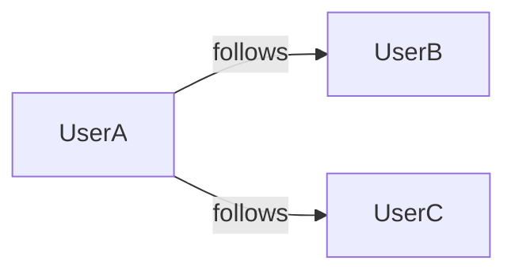

# Escape Rooms Ranked
Online Escape Room ranking and rating service

## System Roadmap & High-Level Design

This document describes the architecture, core components, and data flows of the Escape Room Platform. The platform is a **self-hosted web application**, deployed via **Docker**. It enables users to discover, register, and review real-world escape rooms and track shared experiences with other users.

---

## 1. Goals and Principles

* Centralized, non-duplicated registry of real escape room locations
* Strong data integrity using Google Maps Place IDs
* Community-driven reviews and experience tracking
* Simple, scalable, self-hosted architecture
* Clear separation of frontend, backend, and infrastructure concerns

---

## 2. Technology Stack Overview

### Frontend

* Google Maps Places API (Place ID lookup)

### Backend / Platform Services

### Infrastructure

* Docker & Docker Compose

---

## 3. High-Level System Architecture

---

## 4. Core Domain Model

### Main Entities

* **User**
* **Place** (Escape room location / company)
* **Room** (Specific escape room experience)
* **Rating** (User evaluation of a room)
* **Visit / Run** (A single completed attempt of a room)
* **Tag** (Room attributes)
* **User Relationships** (Favorites / Following)

---

## 5. Authentication & User Management

### Supported Authentication Methods

---

## 6. Place Creation & Verification

### Place Creation Flow

* Users can create a **Place** only by providing a valid Google Maps Place ID
* Place ID ensures:

  * No duplicates
  * Real-world verification
  * Anti-spam protection
* During creation, the user must choose a **Place ownership mode**:

  * **Private (Owned)** – the creating user is the owner

    * Only the owner can edit Place details
    * Only the owner can create, edit, or delete Rooms under the Place
  * **Public (Community-managed)**

    * Any authenticated user may edit Place details
    * Any authenticated user may create, edit, or delete Rooms under the Place

Each place may have:

* Name
* Address
* Google Place ID (unique)
* Ownership mode (Private / Public)
* Owner user ID (if Private)
* One image (vibe/branding)

---

## 7. Room Management

Rooms belong to a Place.

Room creation and editing permissions depend on the Place ownership mode:

* **Private Place**

  * Only the Place owner may create, edit, or delete Rooms
* **Public Place**

  * Any authenticated user may create, edit, or delete Rooms

Room attributes include:

* Name
* Duration
* Description (typically official description)
* Tags (e.g. "live actors", "not plus size friendly")
* One image

> **Verification note:** Ownership-based permissions are enforced via Supabase Row Level Security (RLS). Additional verification (e.g. official place claims) is considered a future enhancement.

---

## 8. Rating & Review System

Users can rate rooms on multiple scales:

* Scary
* Difficulty
* Roleplay
* Overall

Each rating is tied to a **Visit / Run**, not just the room.

### Visit / Run

A user may register multiple visits per room.

Visit data includes:

* Completion time
* Linked users (who participated together)
* Short experience description

---

## 9. Social Features

### User Relationships

* Users can mark other users as **Favorites**
* Favorites appear first in search results
* Users can see:

  * Friends' completed rooms
  * Friends' visited places

No profile pictures are supported at this stage.

---

## 10. Media Handling

* Many images per Place
* Many images per Room

---

## 12. Deployment Overview

---

## 13. Future Roadmap (Non-Exhaustive)

* Room ownership verification
* Moderation tools for places and rooms
* Aggregated statistics and leaderboards
* Advanced tagging and filtering
* Profile customization

---

## 14. Summary

The platform is designed as a clean, modular system where Google Maps Place IDs serve as the backbone for real-world verification, enabling a trustworthy, community-driven escape room discovery and tracking platform.
